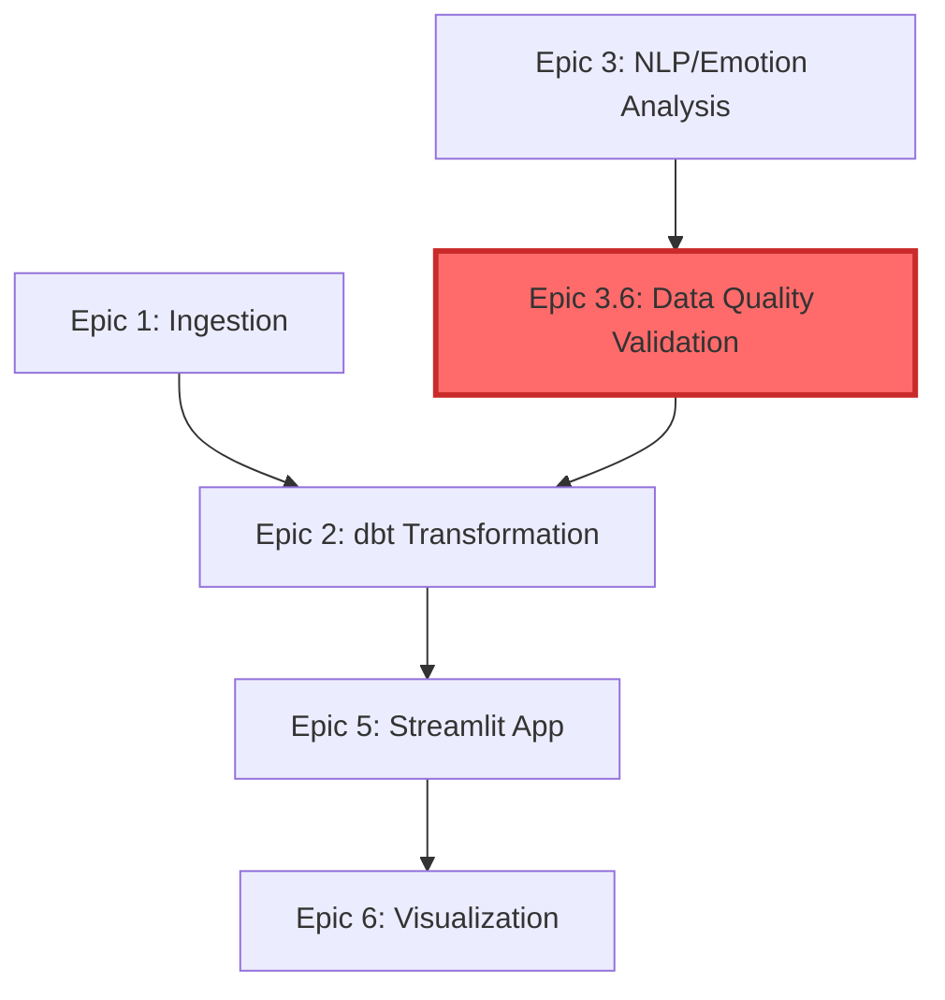

# Sprint Change Proposal: Epic 3.6 - Emotion Analysis Data Quality & Validation

**Date:** 2025-11-24
**Prepared By:** Sarah (Product Owner Agent)
**Triggered By:** Story 5.3 - Film Explorer Page (Data Quality Discovery)
**Status:** ✅ APPROVED
**Priority:** 🔴 HIGH - Blocks Epic 6 Visualization & Portfolio Assets

---


## Executive Summary

During Story 5.3 (Film Explorer Page) validation, we discovered that emotion analysis data extends beyond actual film runtime (e.g., The Red Turtle: 117 min in database vs 77.9 min actual). This reveals a gap in data quality validation that Epic 4.X (subtitle timing quality) did not address. The issue violates the project standard: "delivering at least the correct data."

**Approved Action:** Create **Epic 3.6 - Emotion Analysis Data Quality & Validation** (6 stories, 3-4 weeks) to audit, fix, and validate the emotion pipeline before Epic 6 visualization work.

**Impact:** Epic 6 delayed by 3-4 weeks, but ensures portfolio quality and data credibility.

---

## Analysis Summary

### 1. Issue Context

**What Happened:**
- Story 5.3 discovered The Red Turtle missing from film selector (fixed)
- Further investigation revealed emotion data extends 39 minutes beyond film end
- All top emotion peaks occur in invalid time window (no corresponding subtitles)
- Peak dialogues correctly return empty (defensive behavior working)

**Root Cause:**
- `src/nlp/analyze_emotions.py` likely uses incorrect film duration source
- No cross-validation between emotion pipeline and subtitle metadata
- Epic 4.X addressed subtitle *timing* quality, not emotion *pipeline* quality

**Scope Unknown:** May affect all 20 films × 5 languages = 100 combinations

### 2. Epic Impact

**Completed Epics (1-4.X):**
- ✅ No impact - previous work remains valid
- Epic 4.X was focused on subtitle quality (different dimension)

**Current Epic (Epic 5 - Streamlit App):**
- ✅ Can continue - app code is functionally correct
- App defensively handles invalid data (shows no peaks when none exist)
- Recommendation: Mark Story 5.3 "complete with known upstream dependency"

**Future Epic (Epic 6 - Visualization & Portfolio):**
- 🔴 **BLOCKED** - Cannot publish visualizations with invalid data
- Portfolio credibility depends on data quality
- Must wait for Epic 3.6 completion

### 3. Artifact Impacts

**PRD Updates Required:**
1. Add "Data Quality Standards" section
2. Update Goal #4 to explicitly include validation
3. Add data quality assumption to Technical Assumptions

**Architecture Updates Required:**
1. Add "Data Quality Validation Workflow" to Core Workflows
2. Expand Testing Strategy with data quality tests
3. Update Component Dependencies diagram (add validation layer)
4. Document new dbt validation mart (optional)

**Epic List Update:**
- Insert Epic 3.6 between Epic 5 and Epic 6

---

## Recommended Path Forward

### Create Epic 3.6 - Emotion Analysis Data Quality & Validation

**Epic Goal:** Establish comprehensive data quality framework for emotion analysis pipeline, ensuring all films have validated, consistent emotion data within actual runtime boundaries.

**Why Epic 3.6:**
- Root cause is in Epic 3 emotion analysis pipeline
- Logical placement before Epic 6 (visualization requires validated data)
- Extends Epic 3 work rather than Epic 4 or Epic 5

### Proposed Stories (6 Stories, 10-17 Days)

| Story | Title | Effort | Description |
|-------|-------|--------|-------------|
| **3.6.1** | Comprehensive Emotion Data Audit | 2-3 days | Audit all 100 film-language combos, generate quality report |
| **3.6.2** | Investigate Pipeline Root Cause | 1-2 days | Deep-dive `analyze_emotions.py`, document findings |
| **3.6.3** | Fix Emotion Analysis Pipeline | 2-3 days | Modify pipeline to validate against subtitle duration |
| **3.6.4** | Re-generate Emotion Data | 2-4 days | Re-run analysis for affected films with fixed logic |
| **3.6.5** | Add Data Quality Validation Layer | 2-3 days | Create dbt validation models and quality gates |
| **3.6.6** | Implement Automated Quality Tests | 1-2 days | Add pytest tests, integrate into CI/CD |

**Total Timeline:** 3-4 weeks

### Success Criteria

Epic 3.6 Definition of Done:
1. ✅ Comprehensive audit complete (all 100 film-language combos assessed)
2. ✅ Root cause identified and documented
3. ✅ `analyze_emotions.py` fixed to respect subtitle duration
4. ✅ All affected films re-processed with validated data
5. ✅ dbt validation layer implemented
6. ✅ Automated pytest quality tests passing in CI/CD
7. ✅ Zero runtime overrun violations in final audit
8. ✅ Epic 6 unblocked with confidence in data quality

---

## Specific Proposed Edits

### EDIT 1: PRD - Add Data Quality Standards Section

**File:** `docs/prd/goals-and-background-context.md`

**Location:** After "Goals" section (before "Background Context")

**Add:**
```markdown
## Data Quality Standards

**Minimum Acceptance Criteria for All Data**:
- **Cross-source consistency**: Emotion timeseries must not extend beyond subtitle duration
- **No data loss**: All films with subtitles must appear in analytical datasets
- **Peak accuracy**: Emotion peaks must correspond to actual dialogue content
- **Validation**: Automated tests verify data quality before app deployment

**Quality Assurance Process**:
- Comprehensive audit of all film × language combinations (Epic 3.6)
- Automated validation tests in CI/CD pipeline
- dbt quality gates block downstream marts if validation fails
- Manual spot-checking of high-impact visualizations
```

### EDIT 2: PRD - Update Goal #4

**File:** `docs/prd/goals-and-background-context.md`

**Change FROM:**
```markdown
4. **Sentiment Enrichment**: Implement English sentiment analysis on film dialogue and integrate into queryable dataset
```

**Change TO:**
```markdown
4. **Sentiment Enrichment**: Implement English sentiment analysis on film dialogue, validate data quality across all films/languages, and integrate into queryable dataset with automated quality checks
```

### EDIT 3: PRD - Add Technical Assumption

**File:** `docs/prd/technical-assumptions.md`

**Add to existing assumptions list:**
```markdown
- **Data Quality Assumption**: All analytical data must undergo cross-source validation before consumption by downstream applications (Epic 5+). Epic 3.6 establishes this validation framework.
```

### EDIT 4: PRD - Update Epic List

**File:** `docs/prd/epic-list.md`

**Add after Epic 3.5, before Epic 4:**
```markdown
## Epic 3.6: Emotion Analysis Data Quality & Validation
**Goal**: Establish comprehensive data quality framework for emotion analysis pipeline, auditing all films for runtime consistency, fixing pipeline logic to validate against subtitle duration, and implementing automated quality tests to ensure emotion data integrity before visualization deployment.
```

### EDIT 5: Architecture - Add Data Quality Validation Workflow

**File:** `docs/architecture/core-workflows.md`

**Add new section:**
```markdown
### Data Quality Validation Workflow (Epic 3.6)

**Purpose**: Ensure emotion analysis data integrity before app consumption

**Steps**:
1. Parse subtitle metadata to extract actual film duration (`src/nlp/parse_subtitles.py`)
2. Run emotion analysis pipeline (`src/nlp/analyze_emotions.py`)
3. **NEW**: Cross-validate emotion timeseries `max_minute` ≤ subtitle duration
4. **NEW**: Generate data quality report (PASS/FAIL/WARN per film)
5. **NEW**: Block downstream dbt marts if quality checks fail
6. Transform validated data (Epic 2.5 dbt)
7. Serve to Streamlit app (Epic 5)

**Quality Gates**:
- ✅ **PASS**: `emotion_max_minute ≤ subtitle_duration + 1 min buffer`
- ⚠️ **WARN**: `emotion_max_minute > subtitle_duration` (flag for review)
- ❌ **FAIL**: `emotion_max_minute > subtitle_duration + 5 min` (block downstream)

**Implementation**: Epic 3.6 Stories (3.6.1-3.6.6)
```

### EDIT 6: Architecture - Expand Testing Strategy

**File:** `docs/architecture/13-testing-strategy.md`

**Add after "Integration Tests" section:**
```markdown
## Data Quality Tests (Epic 3.6)

**Goal**: Validate emotion pipeline data integrity

**Test Categories**:

### 1. Runtime Consistency Tests
```python
# tests/integration/test_data_quality.py

def test_emotion_data_within_subtitle_duration():
    """Verify emotion timeseries doesn't extend beyond subtitle duration."""
    conn = duckdb.connect('data/ghibli.duckdb', read_only=True)

    query = """
    SELECT film_title, language_code,
           MAX(minute_offset) as emotion_max_min,
           subtitle_duration_min
    FROM mart_film_emotion_timeseries
    JOIN subtitle_metadata USING (film_id, language_code)
    WHERE emotion_max_min > subtitle_duration_min + 1.0  -- 1 min buffer
    """

    violations = conn.execute(query).df()

    assert len(violations) == 0, \
        f"Found {len(violations)} runtime overruns: {violations}"

def test_all_films_have_emotion_data():
    """Check for data loss - all films with subtitles have emotion data."""
    # Implementation: Compare film count in subtitle_metadata vs emotion tables
    pass

def test_peak_dialogues_exist():
    """Verify emotion peaks have corresponding subtitle content."""
    # Implementation: Join peaks with subtitles, ensure matches exist
    pass
```

### 2. Cross-Source Validation Tests
```python
def test_emotion_duration_matches_subtitle_metadata():
    """Validate emotion source uses correct duration from subtitles."""
    # Implementation: Compare duration sources across tables
    pass

def test_film_count_consistency():
    """Ensure all films present across staging and mart tables."""
    # Implementation: Compare DISTINCT film_id counts
    pass
```

**CI/CD Integration**:
```bash
# .github/workflows/test.yml
- name: Run Data Quality Tests
  run: pytest tests/integration/test_data_quality.py --verbose
```
```

### EDIT 7: Architecture - Update Component Dependencies

**File:** `docs/architecture/component-dependencies-diagram.md`

**Update the Mermaid diagram to include validation layer:**



**Add note below diagram:**
```markdown
**Note:** Epic 3.6 (Data Quality Validation) added 2025-11-24 to ensure emotion pipeline integrity before visualization deployment. Validation layer gates downstream consumption of emotion data.
```

### EDIT 8: Create Epic 3.6 Definition Document

**File:** `docs/prd/epic-3.6-emotion-data-quality.md` (NEW FILE)

**Content:**
```markdown
# Epic 3.6: Emotion Analysis Data Quality & Validation

## Goal
Establish comprehensive data quality framework for emotion analysis pipeline, ensuring all films have validated, consistent emotion data within actual runtime boundaries before visualization deployment.

## Background
Discovered during Story 5.3: emotion timeseries data extends beyond actual film runtime (e.g., The Red Turtle: 117 min DB vs 77.9 min actual). Epic 4.X addressed subtitle *timing* quality but not emotion *pipeline* validation. This epic fixes root cause and prevents regression.

## Stories

### Story 3.6.1: Comprehensive Emotion Data Audit (2-3 days)
- Audit all 20 films × 5 languages = 100 combinations
- Compare emotion `max_minute` vs subtitle metadata duration
- Generate quality report: PASS/WARN/FAIL per film
- Output: `data/quality_reports/emotion_data_audit_report.md`

### Story 3.6.2: Investigate Pipeline Root Cause (1-2 days)
- Deep-dive `src/nlp/analyze_emotions.py`
- Identify duration source (Kaggle? TMDB? Subtitle?)
- Document why emotion extends beyond subtitle end
- Output: Technical investigation document

### Story 3.6.3: Fix Emotion Analysis Pipeline (2-3 days)
- Modify `analyze_emotions.py` to validate against subtitle duration
- Add check: `assert max_emotion_minute <= subtitle_duration + 1`
- Update emotion generation to respect subtitle boundaries
- Backup existing data before changes

### Story 3.6.4: Re-generate Emotion Data (2-4 days)
- Identify films requiring re-processing (from Story 3.6.1)
- Re-run emotion pipeline with fixed logic
- Validate: `max_minute ≤ subtitle_duration`
- Generate before/after comparison report

### Story 3.6.5: Add Data Quality Validation Layer (2-3 days)
- Create dbt model: `int_emotion_data_quality_checks`
- Add validation logic (runtime consistency checks)
- Implement quality gates (block marts if validation fails)
- Add quality metrics to dbt docs

### Story 3.6.6: Implement Automated Quality Tests (1-2 days)
- Add pytest data quality tests (see Architecture doc)
- Integrate into CI/CD pipeline
- Set up pre-deployment quality gate

## Success Criteria
- ✅ All 100 film-language combos audited
- ✅ Root cause documented
- ✅ Pipeline fixed to respect subtitle duration
- ✅ Affected films re-processed with valid data
- ✅ dbt validation layer operational
- ✅ Automated tests passing in CI/CD
- ✅ Zero runtime overrun violations
- ✅ Epic 6 unblocked

## Dependencies
- **Blocks:** Epic 6 (Visualization) - cannot proceed until data validated
- **Unblocks:** Portfolio publication with credible data

## Timeline
3-4 weeks (10-17 days effort)
```

### EDIT 9: Update Story 5.3 Status

**File:** `docs/stories/5.3.film-explorer-page.story.md`

**Add to "Dev Notes" or "Completion Notes" section:**
```markdown
## Known Limitations (Documented 2025-11-24)

**DATA-QUALITY-001: Emotion timeseries runtime overrun**
- **Issue**: Emotion data extends beyond actual film runtime (e.g., The Red Turtle: 117 min vs 77.9 min actual)
- **Impact**: Some films show no peak dialogues despite emotion peaks existing in database
- **Root Cause**: Upstream Epic 3 emotion pipeline uses incorrect duration source
- **App Behavior**: Correctly shows no peaks (defensive behavior working as intended)
- **Resolution**: Epic 3.6 - Emotion Analysis Data Quality & Validation (blocks Epic 6)
- **Status**: Story 5.3 functionally complete; data quality issue tracked separately

**Story 5.3 Recommendation**: Mark as "Ready for Review - Complete with known upstream dependency"
```

---

## PRD MVP Impact

**Is Original MVP Still Achievable?** ✅ YES

- All PRD MVP goals remain achievable
- Epic 3.6 is an enhancement to ensure quality, not scope reduction
- Timeline extends by 3-4 weeks, but goals unchanged

**MVP Goal Modifications:**
- Goal #4 updated to explicitly include "validate data quality" (clarification, not fundamental change)

---

## High-Level Action Plan

### Immediate Actions (This Sprint)

1. ✅ **Approve Sprint Change Proposal** (COMPLETE)
2. **Update PRD** (1 hour)
   - Add Data Quality Standards section
   - Update Goal #4
   - Add technical assumption
   - Add Epic 3.6 to epic list
3. **Update Architecture** (2 hours)
   - Add validation workflow documentation
   - Expand testing strategy
   - Update component dependencies diagram
4. **Create Epic 3.6 Definition** (1 hour)
   - Document 6 stories in detail
   - Define acceptance criteria
5. **Mark Story 5.3 Complete** (30 min)
   - Add known limitations note
   - Update status to "Ready for Review"

### Next Sprint (Epic 3.6 Execution)

6. **Story 3.6.1**: Comprehensive audit (2-3 days)
7. **Story 3.6.2**: Root cause investigation (1-2 days)
8. **Story 3.6.3**: Fix pipeline (2-3 days)
9. **Story 3.6.4**: Re-generate data (2-4 days)
10. **Story 3.6.5**: Add validation layer (2-3 days)
11. **Story 3.6.6**: Automated tests (1-2 days)

### Following Sprint (Resume Epic 6)

12. **Epic 6**: Visualization & Portfolio Assets (unblocked)

---

## Agent Handoff Plan

**Immediate Handoff:**
- ✅ **Sarah (PO)** → **User**: Sprint Change Proposal APPROVED
- **User** → **Developer Agent**: Execute documentation updates (PRD, Architecture)
- **Developer Agent** → **Sarah (PO)**: Create Epic 3.6 story cards

**Epic 3.6 Execution:**
- **Sarah (PO)** → **Developer Agent**: Prioritize Story 3.6.1 (audit)
- **Developer Agent**: Execute Stories 3.6.1-3.6.6 sequentially
- **Developer Agent** → **Sarah (PO)**: Report audit findings (Story 3.6.1 complete)
- **Sarah (PO)** → **Developer Agent**: Approve re-processing scope (Story 3.6.4)

**Epic 6 Resume:**
- **Sarah (PO)** → **Developer Agent**: Unblock Epic 6 after Epic 3.6 complete
- **Developer Agent**: Execute Epic 6 visualization stories

---

## Risk Management

| Risk | Likelihood | Impact | Mitigation |
|------|------------|--------|------------|
| Scope creep (audit reveals more issues) | Medium | High | Define strict Epic 3.6 scope - runtime consistency only |
| Re-processing takes longer than estimated | Medium | Medium | Audit first (3.6.1) to confirm scope before committing |
| Breaking changes to downstream features | Low | Medium | Accept this - corrected data is the goal |
| Epic 6 timeline pressure | Low | Low | 3-4 week delay acceptable for portfolio quality |

---

## Benefits of This Approach

1. ✅ **Root Cause Fixed**: Permanent solution, not workaround
2. ✅ **Prevents Regression**: Automated tests catch future issues
3. ✅ **Portfolio Quality**: Epic 6 visualizations will be credible
4. ✅ **Professional Practice**: Demonstrates data quality rigor
5. ✅ **Aligns with Standards**: Meets "delivering correct data" requirement

---

## Final Status

**APPROVED:** Epic 3.6 creation with 6 stories (3-4 weeks effort) to:
- Audit all emotion data comprehensively
- Fix emotion analysis pipeline at root cause
- Re-generate validated emotion data
- Add automated quality checks to prevent regression
- Unblock Epic 6 with confidence in data quality

**Trade-off Accepted:** Epic 6 delayed by 3-4 weeks for portfolio credibility and data integrity.

---

**Next Action:** Execute immediate actions (documentation updates) and begin Epic 3.6 Story 3.6.1

---

*End of Sprint Change Proposal - APPROVED 2025-11-24*
